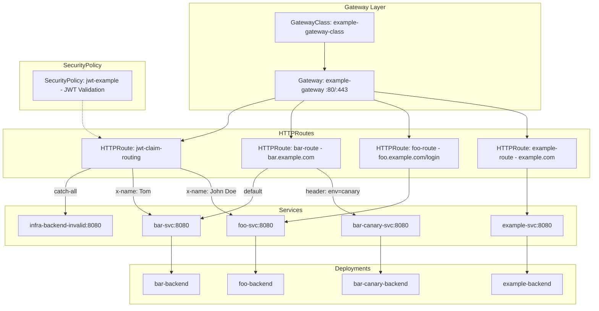

# RouteMaster NL - Logistics Platform

A cloud-native, event-driven logistics platform for tracking shipping containers.

## Architecture

```
                        ┌─────────────────────────────────────────────────────┐
                        │                 Kubernetes Cluster                  │
                        │                                                     │
 GPS/IoT ──HTTP POST──▶ │  ┌─────────────┐      ┌─────────────────────────┐   │
                        │  │  Telemetry  │      │         Kafka           │   │
                        │  │   Service   │─────▶│  container.telemetry    │   │
                        │  └─────────────┘      └───────────┬─────────────┘   │
                        │                                   │                 │
                        │                    ┌──────────────┴──────────────┐  │
                        │                    ▼                             ▼  │
                        │          ┌─────────────────┐          ┌──────────┐  │
                        │          │  Alert Service  │          │ Routing  │  │
                        │          │   (Consumer)    │          │ Service  │  │
                        │          └────────┬────────┘          └──────────┘  │
                        │                   │                                 │
                        └───────────────────┼─────────────────────────────────┘
                                            ▼
                                   Webhook / Email
```

## Project Structure

```
logistics/
├── docker-compose.yaml  # Local development (Kafka)
├── telemetry/           # Telemetry service (Kafka producer, GPS ingestion)
├── alert/               # Notification service (Kafka consumer, sends alerts)
├── routing/             # Route optimization engine (parallel computing)
└── k8s/                 # Kubernetes manifests
    ├── kafka.yaml              # Kafka for K8s (KRaft mode)
    ├── redis.yaml              # Redis
    └── test-service.yaml       # Telemetry service deployment
```

## Telemetry Service

GPS data ingestion service that receives container location data and writes to Kafka.

### API

```
POST /track
Content-Type: application/json

[
  {
    "container_id": "MSCU1234567",
    "lat": 51.9225,
    "lon": 4.47917,
    "timestamp": "2024-01-15T10:30:00Z",
    "speed": 45.5
  }
]
```

**Response**: `202 Accepted`

### Configuration

| Environment Variable | Default | Description |
|---------------------|---------|-------------|
| `KAFKA_BROKERS` | `localhost:9092` | Kafka cluster addresses (comma-separated) |
| `KAFKA_TOPIC` | `container.telemetry` | Target topic |
| `LISTEN_ADDR` | `:8080` | HTTP listen address |

### Running

```bash
# 1. Start Kafka (local development)
docker-compose up -d

# 2. Run telemetry service
cd telemetry
KAFKA_BROKERS=localhost:9092 go run .

# Bazel (local binary - native platform)
bazel run //telemetry:telemetry

# Build container image (cross-compiled for linux/amd64)
bazel build //telemetry:image

# Load into Docker and run
bazel run //telemetry:image_load
docker run -p 8080:8080 -e KAFKA_BROKERS=host.docker.internal:9092 telemetry:latest

# Apple Silicon: use platform emulation
docker run --platform linux/amd64 -p 8080:8080 -e KAFKA_BROKERS=host.docker.internal:9092 telemetry:latest

# Deploy to Kubernetes
bazel run //telemetry:image_load
minikube image load telemetry:latest
kubectl apply -f k8s/test-service.yaml
```

**Build Targets:**

| Target                              | Platform      | Use Case            |
|-------------------------------------|---------------|---------------------|
| `//telemetry:telemetry`             | Native (host) | Local development   |
| `//telemetry:telemetry_linux_amd64` | linux/amd64   | Container binary    |
| `//telemetry:image`                 | linux/amd64   | OCI image           |
| `//telemetry:image_load`            | linux/amd64   | Load image to Docker|
| `//telemetry:push`                  | linux/amd64   | Push to registry    |

### Data Format

| Field | Type | Required | Validation |
|-------|------|----------|------------|
| `container_id` | string | Yes | Non-empty |
| `lat` | float64 | Yes | -90 to 90 |
| `lon` | float64 | Yes | -180 to 180 |
| `timestamp` | RFC3339 | Yes | Non-zero |
| `speed` | float64 | No | >= 0 |

## Build System

This project uses **Bazel** with **bzlmod** for dependency management.

### Why Bazel?

| Feature                     | Benefit                                          |
|-----------------------------|--------------------------------------------------|
| **Hermetic builds**         | Same input = same output, regardless of machine  |
| **Caching**                 | Only rebuild what changed (local + remote cache) |
| **Cross-compilation**       | Build linux/amd64 binaries on macOS/arm64        |
| **Dependency graph**        | Bazel understands the full dependency tree       |
| **Reproducible containers** | OCI images without Dockerfile                    |

### Tools Overview

| Tool | Purpose |
|------|---------|
| **Bazel** | Build system with caching and dependency tracking |
| **bzlmod** | Modern dependency management (replaces WORKSPACE) |
| **rules_go** | Build Go code: `go_binary`, `go_library`, `go_test` |
| **rules_oci** | Build OCI images: `oci_image`, `oci_load`, `oci_push` |
| **rules_pkg** | Package files: `pkg_tar`, `pkg_files` for layers |
| **Gazelle** | Auto-generate BUILD files from Go source |

### File Structure

```
logistics/
├── MODULE.bazel      # External dependencies (like package.json)
├── BUILD.bazel       # Root build targets
├── go.mod            # Go dependencies (read by Gazelle)
├── go.sum            # Go dependency checksums
└── telemetry/
    ├── BUILD         # Service build targets
    ├── main.go
    └── *.go
```

### Container Build Pipeline

The build pipeline converts Go source to a container image without Dockerfile:

```
┌──────────────┐     ┌──────────────┐     ┌──────────────┐     ┌──────────────┐
│  go_binary   │────▶│  pkg_files   │────▶│   pkg_tar    │────▶│  oci_image   │
│ (compile Go) │     │  (rename +   │     │  (create     │     │  (add layer  │
│              │     │   chmod)     │     │   tarball)   │     │   to base)   │
└──────────────┘     └──────────────┘     └──────────────┘     └──────────────┘
                                                                      │
                     ┌──────────────┐     ┌──────────────┐            │
                     │   oci_push   │◀────│  oci_load    │◀───────────┘
                     │ (to registry)│     │ (to Docker)  │
                     └──────────────┘     └──────────────┘
```

**Step-by-step:**

1. **go_binary** - Compiles Go code to a static binary (cross-compiled for linux/amd64)
2. **pkg_files** - Renames binary and sets executable permissions (mode 0755)
3. **pkg_tar** - Creates a tarball layer containing the binary
4. **oci_image** - Combines base image (distroless) + tarball layer + entrypoint
5. **oci_load** - Loads the OCI image into Docker daemon
6. **oci_push** - Pushes to container registry (ghcr.io)

### BUILD File Anatomy

```python
# telemetry/BUILD

# 1. Go library (shared code)
go_library(
    name = "telemetry_lib",
    srcs = ["main.go", "handler.go", ...],
    deps = ["@com_github_segmentio_kafka_go//:kafka-go"],
)

# 2. Native binary (for local development)
go_binary(
    name = "telemetry",
    embed = [":telemetry_lib"],
)

# 3. Cross-compiled binary (for containers)
go_binary(
    name = "telemetry_linux_amd64",
    embed = [":telemetry_lib"],
    goos = "linux",
    goarch = "amd64",
)

# 4. Prepare files with correct permissions
pkg_files(
    name = "telemetry_files",
    srcs = [":telemetry_linux_amd64"],
    attributes = pkg_attributes(mode = "0755"),
    renames = {":telemetry_linux_amd64": "telemetry"},
)

# 5. Create tarball layer
pkg_tar(
    name = "telemetry_layer",
    srcs = [":telemetry_files"],
)

# 6. Build OCI image
oci_image(
    name = "image",
    base = "@distroless_static_linux_amd64",
    entrypoint = ["/telemetry"],
    tars = [":telemetry_layer"],
)

# 7. Load to Docker
oci_load(
    name = "image_load",
    image = ":image",
    repo_tags = ["telemetry:latest"],
)
```

### Cross-Compilation

Bazel can build linux/amd64 binaries on any platform (macOS, Windows, Linux):

| Host Platform | Target Platform | Command                                           |
|---------------|-----------------|---------------------------------------------------|
| macOS arm64   | macOS arm64     | `bazel run //telemetry:telemetry`                 |
| macOS arm64   | linux/amd64     | `bazel build //telemetry:telemetry_linux_amd64`   |
| linux/amd64   | linux/amd64     | `bazel run //telemetry:telemetry`                 |

**Note:** Container images are always linux/amd64. On Apple Silicon, run with:

```bash
docker run --platform linux/amd64 telemetry:latest
```

### Dependency Management

**Adding a new Go dependency:**

```bash
# 1. Add to go.mod
go get github.com/some/package@v1.0.0

# 2. Regenerate BUILD files
bazel run @gazelle//:gazelle

# 3. If top-level dep, add to MODULE.bazel
use_repo(
    go_deps,
    "com_github_some_package",  # Add this line
)
```

**Finding the Bazel repo name:**

```bash
# The repo name follows pattern: com_github_<org>_<repo>
# github.com/segmentio/kafka-go → com_github_segmentio_kafka_go
```

### Build Troubleshooting

| Problem | Cause | Solution |
|---------|-------|----------|
| `cannot execute binary file` | Wrong platform (linux binary on macOS) | Use `bazel run //telemetry:telemetry` for local dev |
| `permission denied` | Binary not executable | Add `attributes = pkg_attributes(mode = "0755")` |
| `no such file or directory` | Binary renamed incorrectly | Check `renames` in `pkg_files` |
| `no matching manifest` | Base image doesn't support platform | Use amd64-only base or different image |
| `undefined: SomeFunc` | Missing dependency | Run `bazel run @gazelle//:gazelle` |
| `module not found` | Dep not in use_repo | Add to `use_repo()` in MODULE.bazel |

## Common Commands

```bash
# Build all targets
bazel build //...

# Run telemetry service locally
bazel run //telemetry:telemetry

# Generate/update BUILD files from Go source
bazel run @gazelle//:gazelle

# Build container image
bazel build //telemetry:image

# Load image into Docker
# ARM64 （Apple Silicon）
bazel run //telemetry:image_load_arm64

# AMD64
bazel run //telemetry:image_load

# Push image to registry
bazel run //telemetry:push

# Load image into Minikube
minikube image load telemetry:latest

# Clean build cache
bazel clean
```

## Getting Started

### Prerequisites

| Tool | Installation | Version |
|------|-------------|---------|
| Bazel | https://bazel.build/install | 7.x |
| Docker | https://docker.com | 24.x |
| Minikube | `brew install minikube` | 1.32+ |
| kubectl | `brew install kubectl` | 1.29+ |
| Helm | `brew install helm` | 3.x |

### Build and Run Locally

```bash
# Build all services
bazel build //...

# Run telemetry service (requires local Kafka)
bazel run //telemetry:telemetry
```

### Deploy to Kubernetes

```bash
kubectl apply -f k8s/
```

## Adding Dependencies

1. Add the dependency to your `go.mod`:

   ```bash
   go get github.com/some/package@v1.0.0
   ```

2. Run Gazelle to update BUILD files:

   ```bash
   bazel run @gazelle//:gazelle
   ```

3. If it's a new top-level dependency, add it to `use_repo()` in `MODULE.bazel`

## Gateway & JWT Troubleshooting

### Understanding JWT Validation

Three URLs must align for JWT validation to work:

1. **Token Issuer** - Written to JWT `iss` claim by Keycloak
   - Controlled by `KC_HOSTNAME` + `KC_HOSTNAME_PORT` env vars
   - Mismatch error: `"Jwt issuer is not configured"`

2. **SecurityPolicy Issuer** - Gateway validates token against this
   - Must **exactly match** Token Issuer (including port)

3. **JWKS URI** - Gateway fetches public keys to verify signature
   - Gateway accesses Keycloak via K8s Service
   - Must use **Service port** (not Pod port)
   - Wrong port error: `"Jwks remote fetch is failed"`

**Pod vs Service Port:**

- `port-forward pod/xxx 8080` → Pod internal port
- `port-forward svc/xxx 80` → Service port (maps to Pod 8080)
- In-cluster access (Gateway) → Must use Service port (80)

**Example Config:**

```yaml
# Keycloak Helm values
- name: KC_HOSTNAME
  value: "keycloak-keycloakx-http.app.svc.cluster.local"
- name: KC_HOSTNAME_PORT
  value: "80"  # Service port, not Pod port

# SecurityPolicy
issuer: http://keycloak-keycloakx-http.app.svc.cluster.local/auth/realms/myrealm
remoteJWKS:
  uri: http://keycloak-keycloakx-http.app.svc.cluster.local/auth/realms/myrealm/protocol/openid-connect/certs
```

---

### JWKS Fetch Failed

**Symptom:**
```
[warning][jwt] Jwks async fetching url=http://keycloak-keycloakx-http.app.svc.cluster.local:80/realms/myrealm/protocol/openid-connect/certs: failed
```

**Possible Causes:**

| Cause | Solution |
|-------|----------|
| Wrong Keycloak path | Keycloak v23+ uses `/realms/...`, older versions use `/auth/realms/...`. Check with `curl` |
| Config not applied | Run `kubectl apply -f infra/gateway/security-policy.yaml -n app` |
| Gateway needs restart | `kubectl delete pod -n app -l gateway.envoyproxy.io/owning-gateway-name=gateway` |

**Diagnostic:**
```bash
# Test JWKS endpoint from inside cluster
kubectl run curl-test --rm -it --image=curlimages/curl --restart=Never -n app -- \
  curl -v http://keycloak-keycloakx-http.app.svc.cluster.local:80/auth/realms/myrealm/protocol/openid-connect/certs
```

---

### JWT Issuer Not Configured (401 Unauthorized)

**Symptom:**
```
HTTP/1.1 401 Unauthorized
www-authenticate: Bearer realm="http://localhost/", error="invalid_token"
Jwt issuer is not configured
```

**Root Cause:** Token's `iss` claim doesn't match SecurityPolicy's `issuer` field.

**Diagnostic - Decode token to find actual issuer:**
```bash
TOKEN=$(curl -s -X POST "http://localhost:8080/auth/realms/myrealm/protocol/openid-connect/token" \
  -d "grant_type=password&client_id=myclient&username=myuser&password=admin" | jq -r '.access_token')

echo $TOKEN | cut -d'.' -f2 | base64 -d 2>/dev/null | jq '.iss'
```

**Fix:** Update `infra/gateway/security-policy.yaml` to match the token's issuer exactly:
```yaml
jwt:
  providers:
  - name: keycloak
    issuer: http://keycloak-keycloakx-http.app.svc.cluster.local:8080/auth/realms/myrealm  # Must match token's iss
    remoteJWKS:
      uri: http://keycloak-keycloakx-http.app.svc.cluster.local:80/auth/realms/myrealm/protocol/openid-connect/certs
```

**Note:** The `issuer` URL often includes port `:8080` (Keycloak's internal port), while `remoteJWKS.uri` uses port `:80` (Service port).

---

### 500 Internal Server Error (Backend Not Found)

**Symptom:**
```
HTTP/1.1 500 Internal Server Error
```

**Diagnostic:**
```bash
# Check if backend pods exist
kubectl get pods -n app -l app=logistics

# Check service endpoints
kubectl get endpoints logistics-svc -n app
```

**Common Cause:** Service selector doesn't match Pod labels.

```yaml
# WRONG - selector and pod labels don't match
apiVersion: v1
kind: Service
spec:
  selector:
    app: logistics-deployment  # Looking for this label

---
apiVersion: apps/v1
kind: Deployment
spec:
  template:
    metadata:
      labels:
        app: logistics-pod      # But pods have this label
```

**Fix:** Ensure Service selector matches Pod labels exactly.

---

### Deployment Selector Immutable Error

**Symptom:**
```
The Deployment "xxx" is invalid: spec.selector: Invalid value: field is immutable
```

**Fix:** Delete and recreate the deployment:
```bash
kubectl delete deployment <name> -n app
kubectl apply -f <manifest>.yaml -n app
```

## K8S structure



## Architecture

```
┌───────────────────────────────────────────────────────────────┐
│                     /etc/hosts (本機)                          │
│   127.0.0.1  auth.example.com                                 │
│   127.0.0.1  logistics.example.com                            │
└───────────────────────────────────────────────────────────────┘
                              │
                              ▼
┌───────────────────────────────────────────────────────────────┐
│            Minikube/Kind + port-forward :443                   │
└───────────────────────────────────────────────────────────────┘
                              │
                              ▼
┌───────────────────────────────────────────────────────────────┐
│                     Envoy Gateway                              │
│   ┌─────────────────────┬─────────────────────────┐           │
│   │ auth.example.com    │ logistics.example.com   │           │
│   │ → Keycloak          │ → Telemetry Service     │           │
│   └─────────────────────┴─────────────────────────┘           │
└───────────────────────────────────────────────────────────────┘
```

## Domain
127.0.0.1    logistics.example.com
127.0.0.1    keycloak-keycloakx-http.app.svc.cluster.local
127.0.0.1    auth.example.com

## Support
macOS and linux

## prerequisite

0. [install minikube](https://minikube.sigs.k8s.io/docs/start/)
1. [install docker](https://docs.docker.com/engine/install/)
2. [install kubectl](https://kubernetes.io/docs/tasks/tools/#kubectl)
3. [install helm](https://helm.sh/docs/intro/install/)
4. [install npm](https://docs.npmjs.com/downloading-and-installing-node-js-and-npm)


## steps

1. minikube start --cpus=4 --memory=8192 --driver=docker
2. kubectl create namespace app

### install kafka

1. kubectl apply -f infra/kafka.yaml -n app
2. kubectl wait --for=condition=Ready pod -l app=kafka -n app --timeout=120s
3. kubectl apply -f https://strimzi.io/examples/latest/kafka/kafka-single-node.yaml -n app

### install gateway

1. helm install eg oci://docker.io/envoyproxy/gateway-helm --version v1.5.7 -n app
2. kubectl apply -k infra/gateway/ -n app

### install keycloak & postgres

1. helm repo add codecentric https://codecentric.github.io/helm-charts -n app
2. helm repo add cnpg https://cloudnative-pg.github.io/charts -n app
3. helm repo update
4. helm install keycloak codecentric/keycloakx --values ./infra/keycloakx/keycloak-server-values.yaml -n app
5. helm upgrade --install cnpg \
  --namespace app \
  cnpg/cloudnative-pg
6. kubectl apply -f infra/keycloakx/postgres-values.yaml -n app
7. kubectl wait --for=condition=Ready pod -l app.kubernetes.io/name=keycloakx -n app --timeout=300s
8. kubectl wait --for=condition=Ready cluster/keycloak-db -n app --timeout=120s
9. kubectl wait --for=condition=available --timeout=300s deployment/cnpg-cloudnative-pg -n app
10. make deploy-tls DOMAIN=app.example.com NAMESPACE=app SECRET_NAME=wildcard-cert
11. open a new terminal and run `sudo minikube tunnel`
12. go to: https://auth.example.com/auth Then follow official tutorial to create realm, client, user
13. ./test-jwt.sh

### Ref

- https://github.com/cloudnative-pg/charts/tree/main/charts/cloudnative-pg
- https://github.com/codecentric/helm-charts/tree/master/charts/keycloakx
- https://www.keycloak.org/getting-started/getting-started-kube

## Frontend

React + TypeScript 前端应用，使用 Keycloak 进行身份认证。

### 安装依赖

```bash
cd frontend
npm install
```

### Keycloak 配置

前端需要配置 `.env` 文件才能连接 Keycloak 进行授权。

**1. 创建环境配置文件：**

```bash
cp frontend/.env.example frontend/.env
```

**2. 编辑 `frontend/.env`：**

```env
VITE_KEYCLOAK_URL=https://auth.example.com/auth
VITE_KEYCLOAK_REALM=myrealm
VITE_KEYCLOAK_CLIENT_ID=myclient
```

| 变量 | 说明 |
|------|------|
| `VITE_KEYCLOAK_URL` | Keycloak 服务器地址（含 `/auth` 路径） |
| `VITE_KEYCLOAK_REALM` | Keycloak Realm 名称 |
| `VITE_KEYCLOAK_CLIENT_ID` | Keycloak Client ID |

**3. Keycloak 端配置（必须）：**

在 Keycloak Admin Console 中配置 Client：

1. 登录 `https://auth.example.com/auth/admin`
2. 选择 Realm → Clients → 点击你的 Client
3. 设置以下字段：

| 字段 | 值 |
|------|-----|
| Valid redirect URIs | `http://localhost:5173/*` |
| Web origins | `http://localhost:5173` |

> 未配置会导致 `Invalid parameter: redirect_uri` 错误

### 启动开发服务器

```bash
cd frontend
npm run dev
```

访问 `http://localhost:5173/`，会自动重定向到 Keycloak 登录页面。
