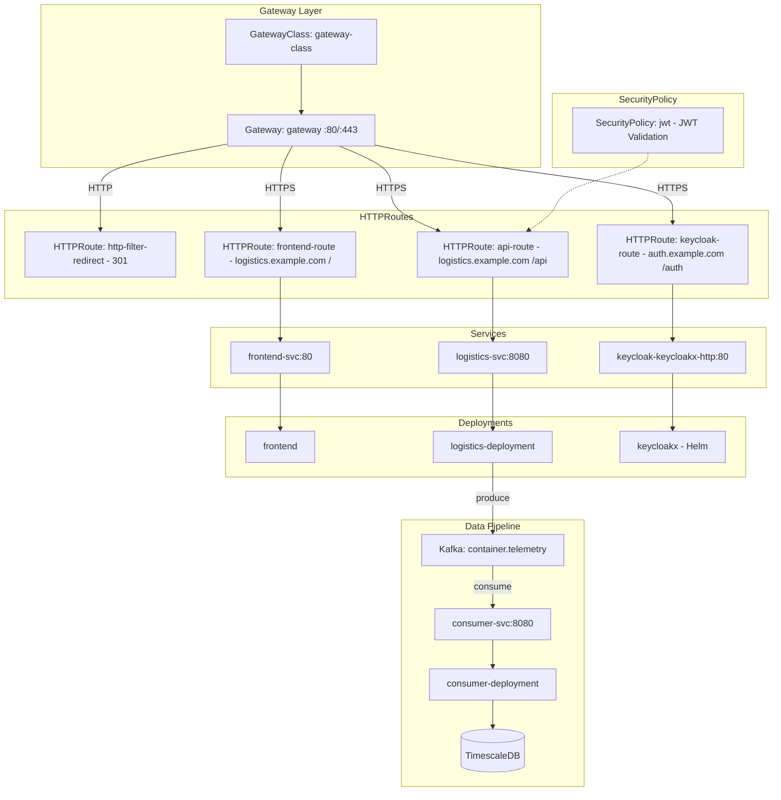
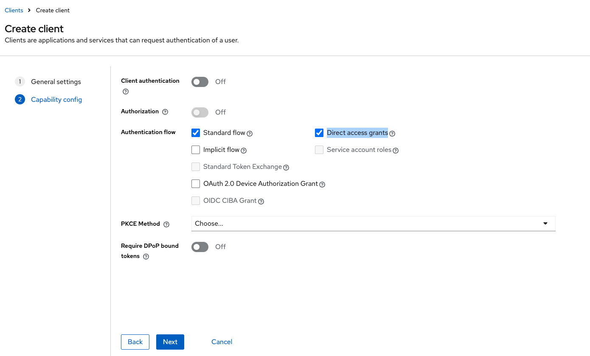
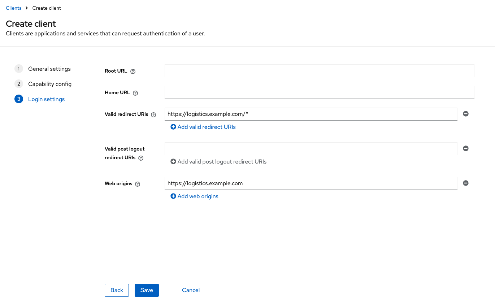

# RouteMaster NL - Logistics Platform

A cloud-native, event-driven logistics platform for tracking shipping containers.

## Architecture

```text
      ┌─────────────────────────────────────────────────────────┐
      │                      Envoy Gateway                      │
      │  auth.example.com → Keycloak                            │
      │  logistics.example.com → Telemetry Service / Nginx      │
      └─────────────────────────────────────────────────────────┘
                  │              │              │
                  │              │              │
                  │              │              │         
                  ▼              ▼              ▼
          ┌───────────┐  ┌─────────────┐  ┌─────────────┐
          │ Keycloak  │  │  Telemetry  │  │    Nginx    │
          │  (auth)   │  │   Service   │  │  (frontend) │
          └───────────┘  └──────┬──────┘  └─────────────┘
                                │                ▲
  GPS Device ─POST /api/track───┘                │
                                │                │ WebSocket
                                │                │
                                ▼                │
                      ┌─────────────────┐        │
                      │      Kafka      │        │
                      │ container.telem │        │
                      └────────┬────────┘        │
                               │ read            │
                  ┌────────────┴────────────┐    │
                  ▼                         ▼    │
          ┌─────────────────┐       ┌───────────────┐
          │   Rule Engine   │       │    Consumer   │
          │  (Geofencing)   │       │    Service    │
          └───────┬─────────┘       └───────┬───────┘
                  │                         │ batch insert
                  │ query zones             ▼
                  │               ┌─────────────────┐
                  └──────────────▶│   TimescaleDB   │
                  │               │    (PostGIS)    │
                  ▼               └─────────────────┘
          ┌─────────────────┐              │
          │  Notification   │──────────────┘
          │     Service     │
          └─────────────────┘
            (Email/SMS/Push)
```

**Local Development Setup:**

Add the following to `/etc/hosts`:

```text
127.0.0.1    logistics.example.com
127.0.0.1    auth.example.com
```

Requests flow: `/etc/hosts` → Minikube tunnel → Envoy Gateway → Services

## Project Structure

```text
logistics/
├── Makefile             # Main build orchestration
├── telemetry/           # GPS ingestion service (Go, Kafka producer)
├── consumer/            # Kafka consumer service (Go, TimescaleDB writer)
├── frontend/            # React + TypeScript SPA (Vite, Keycloak auth)
├── infra/               # Kubernetes infrastructure
│   ├── kafka.yaml       # Strimzi Kafka cluster
│   ├── redis.yaml       # Redis cache
│   ├── keycloakx/       # Keycloak IAM (Helm values)
│   └── gateway/         # Envoy Gateway ingress
├── certs/               # TLS certificate infrastructure
├── docs/                # Documentation and diagrams
├── makefiles/           # Modular Makefile includes
├── .github/             # GitHub Actions workflows
├── notification/        # (Planned) Alert notification service
└── rule-engine/         # (Planned) Rule engine for geofencing
```

## Telemetry Service

GPS data ingestion service that receives container location data and writes to Kafka.

See [Telemetry Service](services/telemetry.md) for:

- API specification and data format
- Configuration options
- Build, run, and test instructions
- Performance characteristics

## Local Documentation

Serve the project documentation locally using MkDocs.

**Prerequisites:**

```bash
# Using uv (recommended)
uv sync

# Or using pip
pip install mkdocs>=1.6.1 mkdocs-simple-blog>=0.3.0
```

**Commands:**

| Command | Description |
|---------|-------------|
| `mkdocs serve` | Start local server at <http://localhost:8000> |
| `mkdocs build` | Build static site to `/site` directory |

## TLS/PKI Setup

This project uses a self-signed PKI for local development with TLS.

**Quick Setup:**

```bash
make init-pki                    # Initialize Root CA and Intermediate CA
make deploy-tls DOMAIN=app.example.com NAMESPACE=app SECRET_NAME=wildcard-cert
```

**Key Commands:**

| Command | Description |
|---------|-------------|
| `make init-pki` | Initialize full PKI (Root + Intermediate CA) |
| `make gen-tls-fast DOMAIN=xxx` | Generate cert without Root CA password |
| `make verify-cert` | Verify certificate validity |
| `make trust-ca-macos` | Trust CA on macOS |

See [TLS/PKI Guide](guides/tls-guide.md) for:

- PKI trust chain architecture
- Certificate types and validity periods
- OpenSSL command reference
- Troubleshooting FAQ

## Getting Started

### Prerequisites

| Tool | Installation |
|------|--------------|
| Minikube | [install](https://minikube.sigs.k8s.io/docs/start/) |
| Docker | [install](https://docs.docker.com/engine/install/) |
| kubectl | [install](https://kubernetes.io/docs/tasks/tools/#kubectl) |
| Helm | [install](https://helm.sh/docs/intro/install/) |
| npm | [install](https://docs.npmjs.com/downloading-and-installing-node-js-and-npm) |
| Go | [install](https://go.dev/dl) (for local dev) |

## Gateway & JWT Troubleshooting

### Understanding JWT Validation

Three URLs must align for JWT validation to work:

1. **Token Issuer** - Written to JWT `iss` claim by Keycloak
   - Controlled by `--hostname` flag (e.g., `--hostname https://auth.example.com/auth`)
   - This is the **external** URL that clients use to access Keycloak
   - Mismatch error: `"Jwt issuer is not configured"`

2. **SecurityPolicy Issuer** - Gateway validates token against this
   - Must **exactly match** Token Issuer (the external URL)

3. **JWKS URI** - Gateway fetches public keys to verify signature
   - Uses **internal** K8s Service URL (Gateway runs inside cluster)
   - Must use Service port (default 80), not Pod port (8080)
   - Wrong port error: `"Jwks remote fetch is failed"`

**Key Concept:** Issuer = external URL (what clients see), JWKS URI = internal URL (what Gateway uses).

**Example Config:**

```yaml
# Keycloak Helm values (keycloak-server-values.yaml)
command:
  - "--hostname"
  - "https://auth.example.com/auth"  # External URL, sets token issuer

# SecurityPolicy (security-policy.yaml)
issuer: https://auth.example.com/auth/realms/myrealm  # Must match token's iss claim
remoteJWKS:
  uri: http://keycloak-keycloakx-http.app.svc.cluster.local/auth/realms/myrealm/protocol/openid-connect/certs  # Internal K8s URL
```

**Note:** The `/auth` prefix in the path comes from the `--hostname` value, not from Keycloak version.

---

### JWKS Fetch Failed

**Symptom:**

```
[warning][jwt] Jwks async fetching url=http://keycloak-keycloakx-http.app.svc.cluster.local/auth/realms/myrealm/protocol/openid-connect/certs: failed
```

**Possible Causes:**

| Cause | Solution |
|-------|----------|
| Wrong Keycloak path | Path depends on `--hostname` config. If set to `https://host/auth`, use `/auth/realms/...` |
| Config not applied | Run `kubectl apply -f infra/gateway/security-policy.yaml -n app` |
| Gateway needs restart | `kubectl delete pod -n app -l gateway.envoyproxy.io/owning-gateway-name=gateway` |

**Diagnostic:**

```bash
# Test JWKS endpoint from inside cluster
kubectl run curl-test --rm -it --image=curlimages/curl --restart=Never -n app -- \
  curl -v http://keycloak-keycloakx-http.app.svc.cluster.local/auth/realms/myrealm/protocol/openid-connect/certs
```

---

### JWT Issuer Not Configured (401 Unauthorized)

**Symptom:**

```
HTTP/1.1 401 Unauthorized
www-authenticate: Bearer realm="http://localhost/", error="invalid_token"
Jwt issuer is not configured
```

**Root Cause:** Token's `iss` claim doesn't match SecurityPolicy's `issuer` field.

**Diagnostic - Decode token to find actual issuer:**

```bash
TOKEN=$(curl -s -X POST "http://localhost:8080/auth/realms/myrealm/protocol/openid-connect/token" \
  -d "grant_type=password&client_id=myclient&username=myuser&password=admin" | jq -r '.access_token')

echo $TOKEN | cut -d'.' -f2 | base64 -d 2>/dev/null | jq '.iss'
```

**Fix:** Update `infra/gateway/security-policy.yaml` to match the token's issuer exactly:

```yaml
jwt:
  providers:
  - name: keycloak
    issuer: https://auth.example.com/auth/realms/myrealm  # External URL, must match token's iss
    remoteJWKS:
      uri: http://keycloak-keycloakx-http.app.svc.cluster.local/auth/realms/myrealm/protocol/openid-connect/certs  # Internal URL
```

---

### 500 Internal Server Error (Backend Not Found)

**Symptom:**

```
HTTP/1.1 500 Internal Server Error
```

**Diagnostic:**

```bash
# Check if backend pods exist
kubectl get pods -n app -l app=logistics

# Check service endpoints
kubectl get endpoints logistics-svc -n app
```

**Common Cause:** Service selector doesn't match Pod labels.

```yaml
# WRONG - selector and pod labels don't match
apiVersion: v1
kind: Service
spec:
  selector:
    app: logistics-deployment  # Looking for this label

---
apiVersion: apps/v1
kind: Deployment
spec:
  template:
    metadata:
      labels:
        app: logistics-pod      # But pods have this label
```

**Fix:** Ensure Service selector matches Pod labels exactly.

---

### Deployment Selector Immutable Error

**Symptom:**

```
The Deployment "xxx" is invalid: spec.selector: Invalid value: field is immutable
```

**Fix:** Delete and recreate the deployment:

```bash
kubectl delete deployment <name> -n app
kubectl apply -f <manifest>.yaml -n app
```

## K8S structure



## Quick Start

**Supported:** macOS, Linux

### 1. Start Cluster

```bash
minikube start --cpus=4 --memory=8192 --driver=docker
kubectl create namespace app
kubectl config set-context --current --namespace=app
```

### 2. Install Kafka

```bash
# Install Strimzi operator
kubectl apply -f 'https://strimzi.io/install/latest?namespace=app' --server-side --force-conflicts

# Deploy Kafka cluster
kubectl apply -f infra/kafka.yaml -n app
```

### 3. Install Gateway

<details>
<summary>Optional: Remove existing Gateway CRDs (if reinstalling)</summary>

```bash
kubectl delete crd \
  backends.gateway.envoyproxy.io \
  backendtlspolicies.gateway.networking.k8s.io \
  backendtrafficpolicies.gateway.envoyproxy.io \
  clienttrafficpolicies.gateway.envoyproxy.io \
  envoyextensionpolicies.gateway.envoyproxy.io \
  envoypatchpolicies.gateway.envoyproxy.io \
  envoyproxies.gateway.envoyproxy.io \
  gatewayclasses.gateway.networking.k8s.io \
  gateways.gateway.networking.k8s.io \
  grpcroutes.gateway.networking.k8s.io \
  httproutefilters.gateway.envoyproxy.io \
  httproutes.gateway.networking.k8s.io \
  referencegrants.gateway.networking.k8s.io \
  securitypolicies.gateway.envoyproxy.io \
  tcproutes.gateway.networking.k8s.io \
  tlsroutes.gateway.networking.k8s.io \
  udproutes.gateway.networking.k8s.io \
  xbackendtrafficpolicies.gateway.networking.x-k8s.io \
  xlistenersets.gateway.networking.x-k8s.io \
  --ignore-not-found=true
```

</details>

```bash
# Install Envoy Gateway
helm install eg oci://docker.io/envoyproxy/gateway-helm --version v1.5.7 -n app

# Apply gateway config
kubectl apply -k infra/gateway/ -n app
```

### 4. Install Keycloak & PostgreSQL

```bash
# Add Helm repos
helm repo add codecentric https://codecentric.github.io/helm-charts
helm repo add cnpg https://cloudnative-pg.github.io/charts
helm repo update

# Install Keycloak
helm install keycloak codecentric/keycloakx \
  --values ./infra/keycloakx/keycloak-server-values.yaml -n app

# Install CloudNative PG operator
helm upgrade --install cnpg cnpg/cloudnative-pg --namespace app

# Deploy PostgreSQL cluster
kubectl apply -f infra/keycloakx/postgres-values.yaml -n app
```

### 5. Configure TLS

```bash
# Generate certificates
make init-pki

# Deploy to cluster
make deploy-tls DOMAIN=app.example.com NAMESPACE=app SECRET_NAME=wildcard-cert
```

Open a new terminal and run:

```bash
sudo minikube tunnel
```

### 6. Configure Keycloak

1. Go to <https://auth.example.com/auth>
2. Follow the [official tutorial](https://www.keycloak.org/getting-started/getting-started-kube#_create_a_realm) to create realm, client, user
3. Enable **Direct access grants**:
   
4. Set redirect URIs:
   - **Valid redirect URIs:** `https://logistics.example.com/*`
   - **Web origins:** `https://logistics.example.com`
   

### 7. Deploy Services

```bash
# Deploy TimescaleDB
kubectl apply -f consumer/timescaledb/deployment.yaml -n app

# Run migrations
kubectl apply -f consumer/migrate-jobs/migrations-configmap.yaml
export VERSION=$(git rev-parse --short HEAD)
envsubst < consumer/migrate-jobs/migrate-job.yaml | kubectl apply -f -

# Deploy services
make redeploy-logistics   # Telemetry service
make redeploy-consumer    # Consumer service
make frontend-redeploy    # Frontend
```

### 8. Verify Installation

```bash
# Check all pods are running
kubectl get pods -n app

# Wait for Kafka
kubectl wait --for=condition=Ready pod -l app=kafka -n app --timeout=120s

# Wait for Keycloak
kubectl wait --for=condition=Ready pod -l app.kubernetes.io/name=keycloakx -n app --timeout=300s

# Wait for PostgreSQL
kubectl wait --for=condition=Ready cluster/keycloak-db -n app --timeout=120s
kubectl wait --for=condition=available deployment/cnpg-cloudnative-pg -n app --timeout=300s

# Wait for migrations
kubectl wait --for=condition=complete job/consumer-migrate-${VERSION} -n app --timeout=120s

# Test JWT auth
./test-jwt.sh
```

Open <https://logistics.example.com> to access the application.

### Ref

- <https://github.com/cloudnative-pg/charts/tree/main/charts/cloudnative-pg>
- <https://github.com/codecentric/helm-charts/tree/master/charts/keycloakx>
- <https://www.keycloak.org/getting-started/getting-started-kube>

## Frontend

React + TypeScript frontend application using Keycloak for authentication.

### Install Dependencies

```bash
cd frontend
npm install
```

### Keycloak Configuration

The frontend requires a `.env` file to connect to Keycloak for authorization.

**1. Create the environment configuration file:**

```bash
cp frontend/.env.example frontend/.env
```

**2. Edit `frontend/.env`:**

```env
VITE_KEYCLOAK_URL=https://auth.example.com/auth
VITE_KEYCLOAK_REALM=myrealm
VITE_KEYCLOAK_CLIENT_ID=myclient
```

| Variable | Description |
|----------|-------------|
| `VITE_KEYCLOAK_URL` | Keycloak server address (including `/auth` path) |
| `VITE_KEYCLOAK_REALM` | Keycloak Realm name |
| `VITE_KEYCLOAK_CLIENT_ID` | Keycloak Client ID |

**3. Keycloak Client Configuration (Required):**

Configure the Client in Keycloak Admin Console:

1. Login to `https://auth.example.com/auth/admin`
2. Select Realm → Clients → Click your Client
3. Set the following fields:

| Field | Value |
|-------|-------|
| Valid redirect URIs | `http://localhost:5173/*` |
| Web origins | `http://localhost:5173` |

> Without this configuration, you will get an `Invalid parameter: redirect_uri` error

### Start Development Server

```bash
cd frontend
npm run dev
```

Visit `http://localhost:5173/`, which will automatically redirect to the Keycloak login page.
