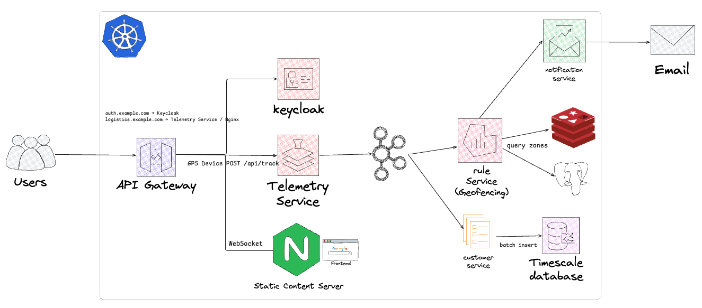

# RouteMaster NL Documentation

A cloud-native, event-driven logistics platform for tracking shipping containers.

## Quick Links

- [TLS/PKI Guide](guides/tls-guide.md) - Certificate management and PKI setup

## Architecture Overview

## Getting Started

See the [Getting Started](getting-started.md) guide for setup instructions.
